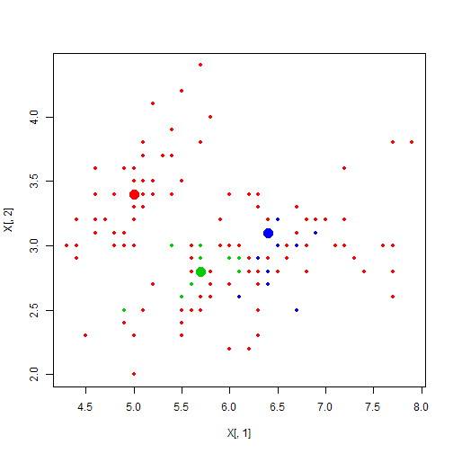

```r
source('../R/densPeak.R')
data(iris)

result = densPeak(iris[,1:4], centers=3, dc=1,dc.range=c(0.02,0.1))
```

```
## dc is corrected to be 0.5 and the percentage is 0.07138 .
```

  

```r
table(result$cluster,iris[,5])
```

```
##    
##     setosa versicolor virginica
##   0      0         34        48
##   1     50          0         0
##   2      0         11         0
##   3      0          5         2
```
