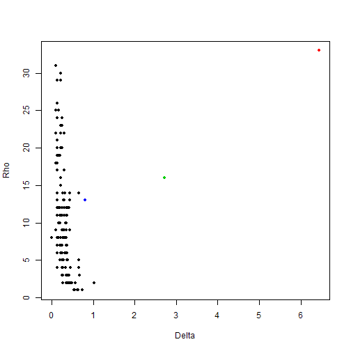
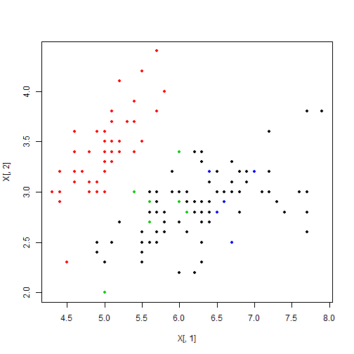

```r
source('../R/densPeak.R')
data(iris)

result = densPeak(iris[,1:4], centers=3, dc=1,dc.range=c(0.01,0.02))
```

```
## dc is corrected to be 0.25 and the percentage is 0.01724 .
```

  

```r
table(result$cluster,iris[,5])
```

```
##    
##     setosa versicolor virginica
##   1     50          0         0
##   2      0         41         2
##   3      0          9        48
```
