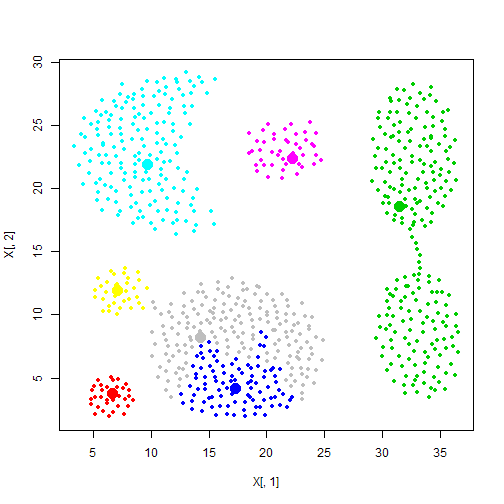
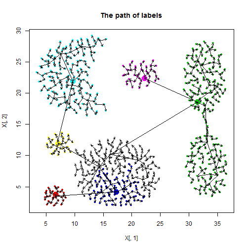
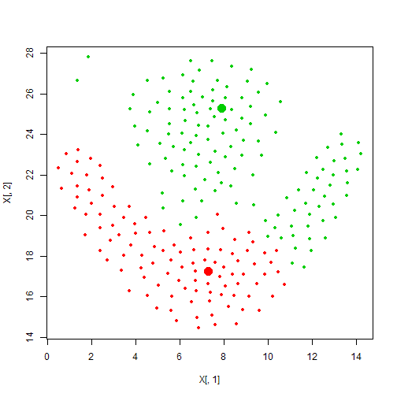
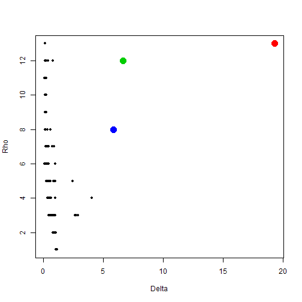
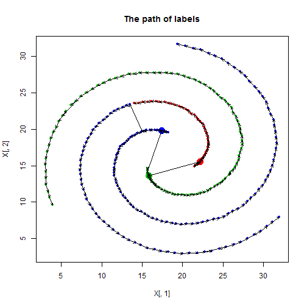

Demos for densPeak
==================


```r
source('../R/densPeak.R')
```

Download data from [http://cs.joensuu.fi/sipu/datasets/](http://cs.joensuu.fi/sipu/datasets/)

## Aggregation


```r
aggregation = read.table('data/Aggregation.txt')
result = densPeak(aggregation[,1:2], centers=7, dc=1,dc.range=c(0.01,0.02))
```

```
## dc is corrected to be 1.591 and the percentage is 0.01601 .
```

   

## Flame


```r
flame = read.table('data/flame.txt')
result = densPeak(flame[,1:2], centers=2, dc=1,dc.range=c(0.01,0.02))
```

```
## dc is corrected to be 0.75 and the percentage is 0.01587 .
```

   

## Spiral


```r
spiral = read.table('data/spiral.txt')
result = densPeak(spiral[,1:2], centers=3, dc=1,dc.range=c(0.01,0.02))
```

```
## dc is corrected to be 1 and the percentage is 0.01393 .
```

   
